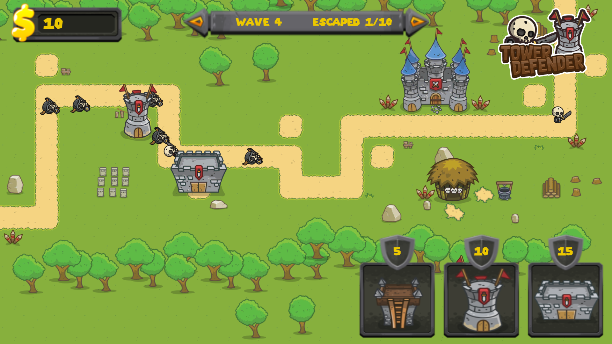
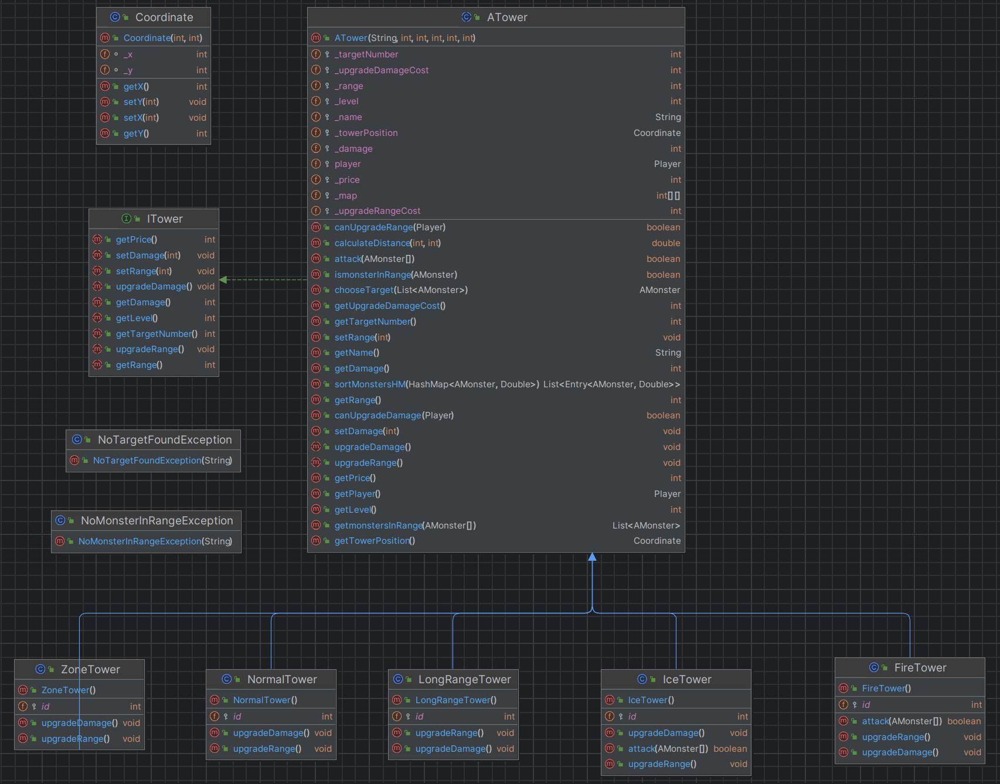
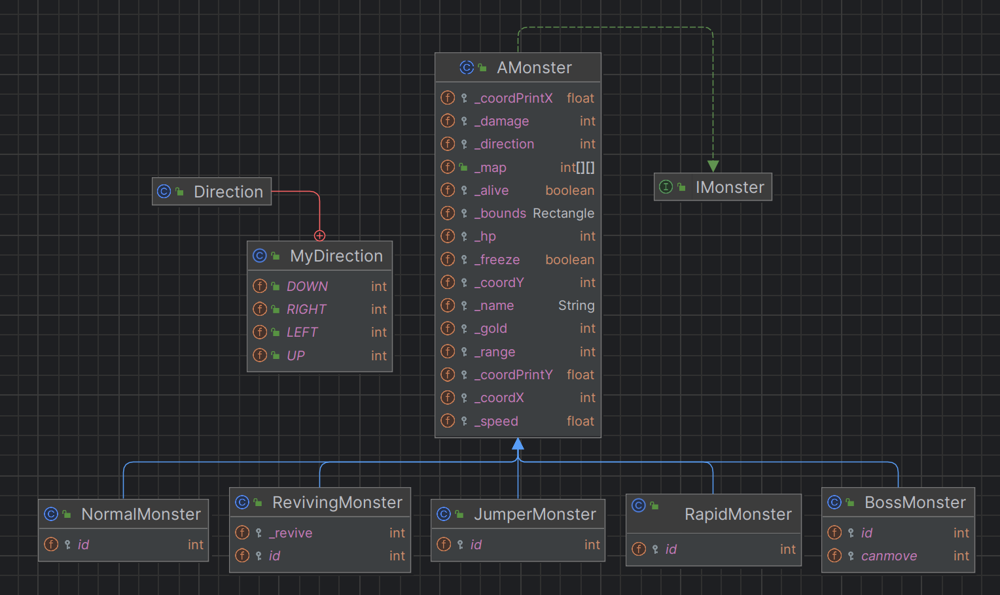

# Projet "Tower Defense"


## Table des Matières
- [Équipe](#équipe)
- [Introduction](#introduction)
- [Comment Faire Fonctionner le Projet](#éxécuter-le-jeu)
- [Diagrammes UML](#diagrammes-uml)
- [Objectifs Atteints](#objectifs-atteints)
- [Difficultés Résolues](#difficultés-résolues)
- [Journal de Bord](#journal-de-bord)
- [Comment Contribuer](#comment-contribuer)

## Équipe

### Yanis Gherdane
- **Rôle principal:** Développeur responsable du code lié aux tours et aux fonctions d'attaque.
    - Implémentation des mécanismes de jeu selon les spécifications.
    - Tests approfondis des fonctionnalités du jeu.
    - Optimisation du code pour assurer des performances optimales.

### Samy
- **Rôle principal:** Développeur et responsable de l'interface graphique.
    - Implémentation des éléments d'interface graphique.
    - Intégration des composants visuels dans le jeu.
    - Tests et débogage de l'interface.
    - Collaboration avec Yanis et Jonathan pour la coordination du code.

### Jonathan
- **Rôle principal:** Développeur spécialisé dans la gestion des monstres.
    - Implémentation des mécanismes et mouvements des monstres et attaque du château.
    - Tests approfondis des fonctionnalités liées aux monstres.
    - Optimisation du code pour assurer des performances optimales.


### La Gestion
La gestion du projet s'est faite de manière collaborative entre les membres du groupe en applicant au mieux une méthodoloogie Agile.

## Introduction
Ce dépôt GitHub contient le code source et les artefacts associés à notre projet, une simulation de jeu "Tower Defense" en Java, mettant en œuvre les principes de la programmation orientée objet (POO).




## Diagrammes UML

### Towers


### Monsters


## Comment Faire Fonctionner le Projet

Pour exécuter le projet, suivez ces étapes :
1. Clonez ce dépôt sur votre machine locale :
    ```bash
    git clone [git@github.com:EpitechMscProPromo2026/T-JAV-501-PAR_20.git]
    ```
2. Naviguez vers le répertoire du projet :
    ```bash
    cd T-JAV-501-PAR_20
    ```
3. Assurez-vous d'avoir Java installé sur votre machine.
4. Exécutez le script `compile.sh` pour compiler et lancer le jeu :
    ```bash
    ./compile.sh
    ```
   Ce script prend en charge la compilation de toutes les classes nécessaires.
5. Profitez du jeu Tower Defense !

## Remarques :
- Assurez-vous d'avoir les droits d'exécution sur le fichier `compile.sh` :
    ```bash
    chmod +x compile.sh
    ```
- En cas de problèmes, vérifiez les messages d'erreur lors de la compilation et assurez-vous que toutes les dépendances sont satisfaites.
Nous vous encourageons à explorer et à contribuer à ce projet [Comment Contribuer](#Comment-Contribuer). Si vous rencontrez des problèmes ou avez des questions, n'hésitez pas à nous contacter ou à soulever des questions dans la section des problèmes (issues) sur GitHub.

## Objectifs Atteints

- Conception des classes suivant les principes de la POO.
- Utilisation de classes et fonctions abstraites pour optimiser le code.
- Implémentation de l'héritage et du polymorphisme.
- Réalisation réussie des classes du jeu.
- Tests exhaustifs des classes réalisés avec succès.
- Un jeu fonctionnel où les tours attaquent les monstres à proximité.
- Coordination efficace au sein de l'équipe pour assurer la cohérence du code.

### Difficultés Résolues

- Compréhension initiale des exigences du sujet.
- Définition initiale des classes avec les ambiguïtés dans l'énoncé.
- Amélioration progressive de la conception en utilisant une approche itérative.
- Implémentation des tours dans l'interface graphique.
- Identification et correction des erreurs lors des tests des premières classes.

## Journal de Bord

### Étape 1 (Day 1)
- Analyse du sujet et compréhension des exigences du projet attendues par l'équipe pédagogique d'EPITECH.
- Définition des différentes spécifications et fonctionnalités que le jeu doit avoir.
- Recherches approfondies et consultation des différentes documentations et forums sur internet pour décider des technologies et librairies à utiliser.

### Étape 2 (Day 2)
- Choix des technologies et librairies à utiliser.
    - Les principes de la POO en JAVA pour le développement des classes.
    - SWING et AWT pour l'interface graphique.
- Planification initiale des différentes étapes à suivre pour développer notre jeu.
- Implémentation des diagrammes UML correspondants aux classes à définir.

### Étape 3 (Day 3 - Day 7)
- Création des classes liées aux Monstres et développement des méthodes des monstres et des vagues de monstres.
- Développement des classes liées aux Tours ainsi que les méthodes spécifiques aux tours.
- Développement initial de l'interface graphique et des différents boutons que doit contenir notre interface graphique.

### Étape 4 (Day 7 - Day 10)
- Implémentation graphique des monstres.
- Implémentation graphique des tours.
- Finalisation des différentes visualisations que doit avoir l'interface graphique.

### Étape 5 (Day 11 - Day 13)
- Tests unitaires et vérifications des fonctionnalités avec corrections des bugs.

### Étape 6 (Day 14)
- Vérification finale du fonctionnement et des spécificités du jeu.

## Comment Contribuer

Pour contribuer à ce projet, veuillez suivre ces étapes :

1. Clonez ce dépôt sur votre machine locale.
2. Créez une branche pour votre fonctionnalité ou correction de bug.
3. Effectuez vos modifications.
4. Testez vos modifications de manière approfondie.
5. Soumettez une demande de fusion (pull request) vers la branche principale du projet.

Nous accueillons les contributions et les retours d'expérience pour améliorer ce projet. Pour toute question ou préoccupation, n'hésitez pas à nous contacter à [yanis.gherdane@epitech.eu].
